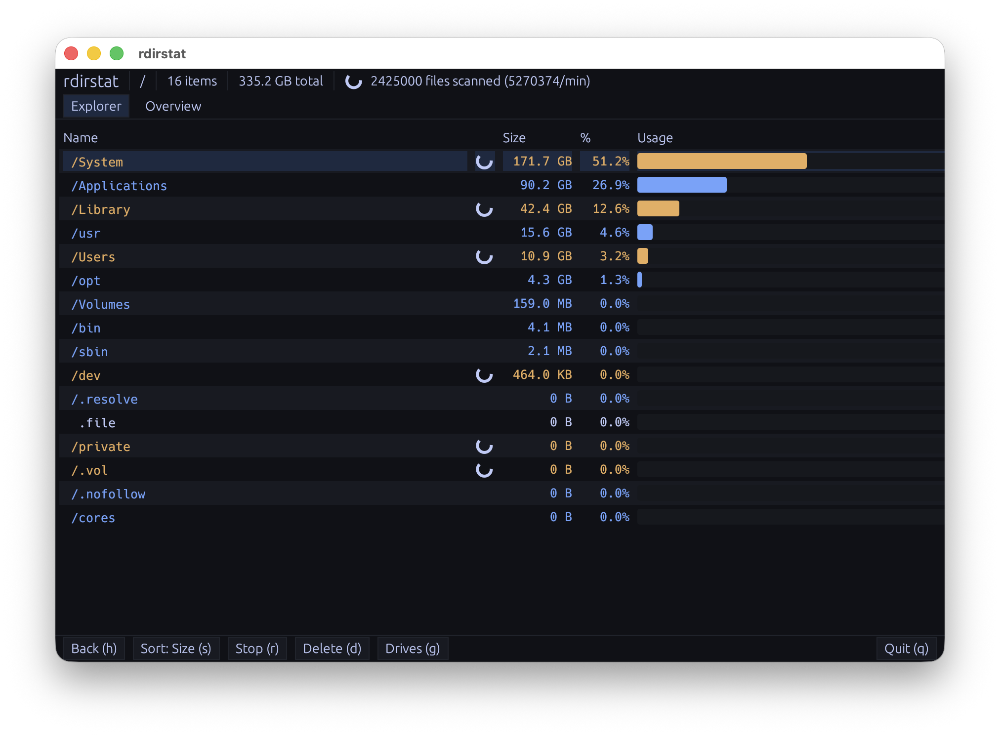
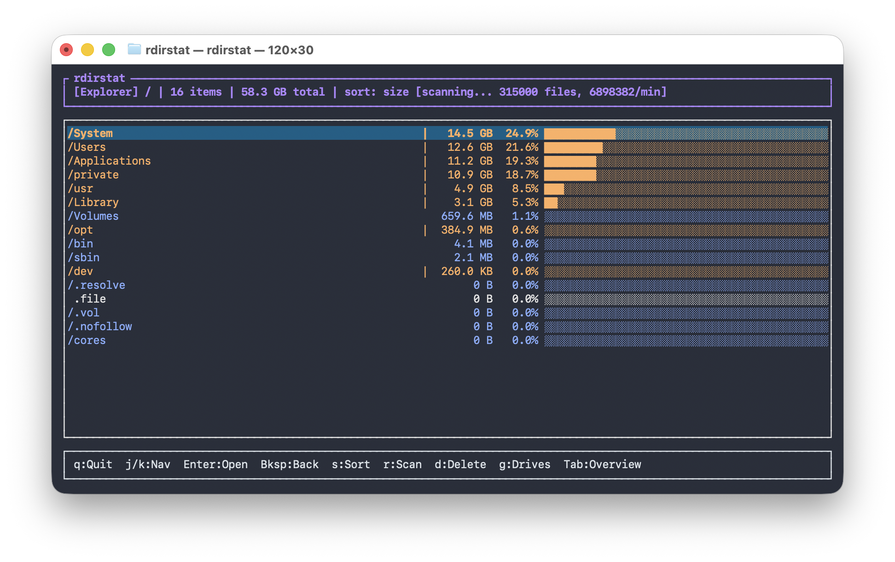
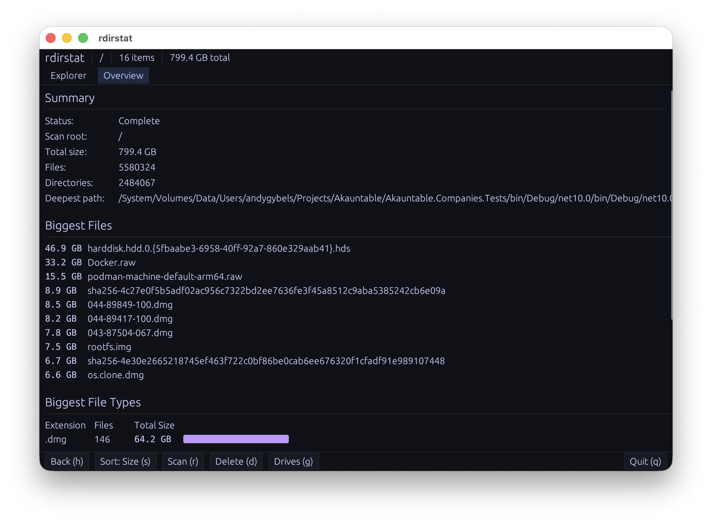
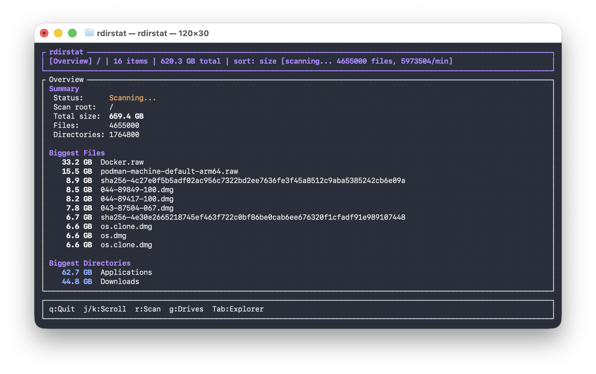

# rdirstat

A fast disk usage analyzer in the WinDirStat / KDirStat / `ncdu` family — written
in Rust, ships as both a terminal UI and a native desktop GUI from the same
scanner core.



## Why

I wanted a disk-usage tool that's actually fast. Existing options either took
forever on large trees or had visible UI lag while scanning. rdirstat walks
the filesystem in parallel via the `ignore` crate, keeps a live shared state,
and snapshots it at 100 ms intervals so the UI stays responsive even mid-scan.

I also wanted both a TUI (for SSH sessions and dotfile-machines) and a native
desktop GUI, without maintaining two scanners. rdirstat ships
both — they share the exact same engine and snapshot pipeline; only the
rendering layer differs.

## Screenshots

| GUI | TUI |
|---|---|
|  |  |
|  |  |

Both frontends share an Explorer view (entry list with size bars) and an
Overview view (totals + biggest files / dirs / extensions).

## Install

### Pre-built binaries

GitHub Releases ships:

- **Linux**: `.tar.gz`, `.deb`, and `.rpm` for both `x86_64` and `aarch64`.
- **macOS**: `.tar.gz` for `x86_64-apple-darwin` and `aarch64-apple-darwin`.
- **Windows**: `.exe` Inno Setup installer for `x86_64`.

```sh
# Fedora / RHEL / Alma / Rocky / openSUSE
sudo rpm -i rdirstat-<ver>-1.x86_64.rpm rdirstat-gui-<ver>-1.x86_64.rpm

# Debian / Ubuntu
sudo dpkg -i rdirstat_<ver>_amd64.deb rdirstat-gui_<ver>_amd64.deb
```

Releases live at <https://github.com/AndyGybels/rdirstat/releases>.

### From source

Requires Rust ≥ 1.78 (2021 edition).

```sh
git clone https://github.com/AndyGybels/rdirstat.git
cd rdirstat
cargo install --path rdirstat       # TUI
cargo install --path rdirstat-gui   # GUI
```

On Linux the GUI build also needs the usual desktop dev libs:

```sh
sudo apt-get install -y \
  libxcb-render0-dev libxcb-shape0-dev libxcb-xfixes0-dev \
  libxkbcommon-dev libgtk-3-dev libatk1.0-dev
```

## Usage

```sh
rdirstat                # TUI in current directory
rdirstat /              # TUI scanning the whole disk
rdirstat-gui            # GUI in current directory
rdirstat-gui ~/Projects # GUI scanning a path
```

### TUI keybindings

| Key | Action |
|---|---|
| `j` / `k` | Move selection down/up |
| `Enter` / `→` / `l` | Enter directory |
| `Backspace` / `←` / `h` | Go up one level |
| `s` | Toggle sort: size ↔ name |
| `r` | Start / stop scan in current dir |
| `d` | Delete selected entry (asks first) |
| `g` | Pick a drive / mount |
| `Tab` | Switch between Explorer / Overview |
| `q` or `Esc` | Quit |

### GUI

The GUI exposes the same functionality through both keyboard shortcuts (same
keys as the TUI) and a toolbar. It runs egui via eframe and starts in **manual
scan mode** — press `r` or click **Scan (r)** to begin.

## Architecture

```
rdirstat-core  ─── scanning engine + shared state + UI snapshots
   │                  │
   │                  ├── scan.rs      parallel walker, allocated-size
   │                  │                accounting, inode dedup, real
   │                  │                post-order completion
   │                  ├── snapshot.rs  100 ms snapshot pump for the UIs
   │                  ├── app.rs       directory navigation + history
   │                  └── mounts.rs    drive picker
   │
   ├── rdirstat       (TUI)  ratatui + crossterm
   └── rdirstat-gui   (GUI)  eframe + egui (wgpu/Metal/Vulkan/DX12)
```

Both frontends consume the same `UiSnapshot` data structure; neither reads
the live `ScanState` directly. This keeps the rendering paths simple and
means the engine can be reused — e.g. for a future web frontend or a
non-interactive `--summary` mode.

## Packaging

CI (`.github/workflows/release.yml`) is triggered by `v*` tags and builds:

- platform binaries for Windows / Linux × {`x86_64`, `aarch64`} / macOS × {Intel, Apple Silicon}
- `.deb` for both Linux architectures (via `cargo-deb`)
- `.rpm` for both Linux architectures (via `cargo-generate-rpm`)
- a Windows installer (Inno Setup)

All artifacts attach to the GitHub Release automatically.

## License

MIT — see the SPDX expression in each crate's `Cargo.toml`.

Contributions welcome. The codebase's most opinionated invariants
(allocated-size accounting, inode dedup, post-order completion) are exercised
by `cargo test -p rdirstat-core`; please keep them green.
